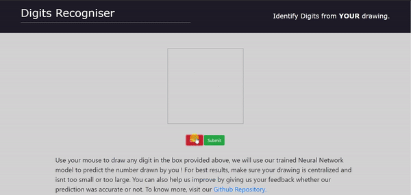
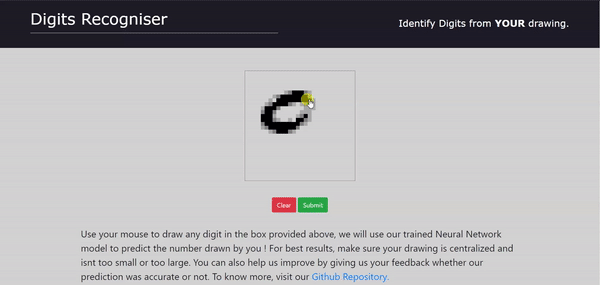

# Recognize handwritten digits - Web Assembly using Rust

## About

This project is contributed by : Yashodhan Joshi , Vatsal Soni, Yatharth Vyas & Tejas Ghone.
Neural networks currently provide the best solutions to many problems in image recognition, speech recognition, and natural language processing etc.
In this project we have incorporated our trained Neural Network for Recognizing handwritten digits which has been implemented in Rust in a basic node server which basically serves a view for taking handwritten digit input and predicting it as our output!

## Building

Install tools except cargo-generate as shown [here](https://rustwasm.github.io/docs/book/game-of-life/setup.html)
<code>wasm-pack build </code> in main directory to compile the rust code to wasm, adn create pkg directory.
<code>npm install && npm start</code> in www folder to install required npm module and start the server on localhost:8080.

## About the network

<h4>Neural Net for predicting handwritten digits</h4>
You can take a look at our Neural Net for recognizing handwritten digits over [here](https://github.com/YJDoc2/Rust-NN)

<h4>Web Assembly using Rust</h4>
We have used wasm pack which is a tool that seeks to be a one-stop shop for building and working with rust-generated WebAssembly that you would like to interop with JavaScript, in the browser or with Node.js.Rust provides a library called as wasm-bindgen which is a CLI tool that facilitate high-level interactions between wasm modules and JavaScript. More specifically this allows JS/wasm to communicate with strings, JS objects, classes, etc, as opposed to purely integers and floats. Using wasm-bindgen for example you can define a JS class in Rust or take a string from JS or return one. We have defined a function in Rust in our wasm package for taking the digit input in the form of a 1D numpyArray as Js array which comprises of various pixel values which forms the weights of the neurons of the first layer in our model. The output is then returned in the form of a integer value.
U can view the functional code in the lib.rs file of the src folder and also the use code in the file index.js of the www folder.

<h4>Using our Trained model to predict the input digit</h4>
The input is taken from the user which is then passed to the guess function of our wasm package . The guess function then runs our Net on the input array . We have used the weights and biases of the trained network for predicting the input digit . U can find the weights and biases in the network.json file of www folder. The function then returns a value in range 0-9 which in turn is the predicted output
For adding randomization we have trained the model on data having noise and shifts as well.The code can be viewed in lib.rs file of src folder

## Usage

Simply draw in the box provided and press the Predict button to know the result.

You can also provide feedback if the model predicts your drawing incorrectly, as of now we haven't implemented anything to improve the model based on the feedback but that can be done in the future.

